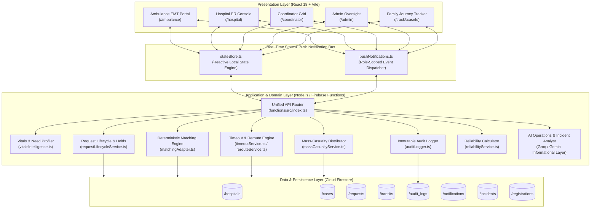

# Raahi — Capability-Match Ambulance–Hospital Coordination System

> **Deterministic clinical triage, atomic bed-hold commitments, and automated dynamic rerouting for emergency medical transport.**

[](https://www.typescriptlang.org/)
[](https://reactjs.org/)
[](https://vitejs.dev/)
[](https://firebase.google.com/)
[](https://vitest.dev/)

---

## Table of Contents

- [1. Problem Statement](#1-problem-statement)
- [2. Proposed Solution](#2-proposed-solution)
- [3. Key Features](#3-key-features)
- [4. System Architecture](#4-system-architecture)
- [5. Technology Stack](#5-technology-stack)
- [6. API Reference](#6-api-reference)
- [7. Database Schema & Data Model](#7-database-schema--data-model)
- [8. Setup & Installation](#8-setup--installation)
- [9. How to Run](#9-how-to-run)
- [10. Demo Credentials](#10-demo-credentials)
- [11. Project Structure](#11-project-structure)
- [12. Disclosures & Third-Party Components](#12-disclosures--third-party-components)
- [13. Team & Contributions](#13-team--contributions)

---

## 1. Problem Statement

Emergency medical response in regional urban centers faces three systemic coordination failures during the critical "Golden Hour":

1. **Blind Routing to Nearest Facilities:** Ambulances traditionally route patients to the geographically closest hospital without verifying whether the facility currently possesses the specialized capabilities required for the patient's acute condition (e.g., an available catheterization lab for STEMI, on-duty pediatric neurosurgeons, or crossmatched O-negative blood).
2. **Fatal Secondary Inter-Hospital Transfers:** When an ambulance arrives at an overcrowded or clinically ill-equipped emergency department, the patient must be stabilized, re-triaged, and transferred to another facility. Secondary transfers add 45–90 minutes of transit delay, drastically escalating mortality rates in cardiac arrest, acute stroke, and severe trauma.
3. **Passive Dashboard Limitations & Resource Contention:** Existing municipal health dashboards display static, unreserved bed counts. Because these dashboards do not support transactional commitments or reservations, multiple ambulances frequently converge simultaneously on the same facility, causing sudden emergency room saturation and race conditions over scarce clinical resources.

---

## 2. Proposed Solution

**Raahi** replaces passive bed-monitoring dashboards with an active, deterministic **capability-match and two-phase commitment protocol**:

- **Deterministic Clinical Need Profiling:** Converts field triage observations, vital signs, and symptoms into a structured clinical requirement profile (required medical specialists, clinical capability flags, blood products, and equipment) via a rule-based Directed Acyclic Graph (DAG) with zero non-deterministic hallucination risk.
- **Multi-Constraint Capability Matching:** Evaluates and ranks regional hospitals using four verifiable parameters: capability match fidelity, real-time emergency department surge load, distance/travel time (Haversine formula), and telemetry data freshness.
- **Time-Bounded Commitment Handshake:** Dispatches a direct, 60-second allocation request with an active countdown timer to the top-ranked hospital.
- **Automated Dynamic Failover & Rerouting:** If the primary hospital declines the request or the 60-second window expires without response, Raahi instantly and automatically cascades the allocation request to the next optimal facility in the ranked candidate list without manual dispatcher delay.
- **Atomic Resource Holds:** Uses transactional first-write-wins locking to reserve beds and clinical assets upon acceptance, preventing duplicate allocation.
- **Mid-Transit Invalidation Safeguard:** Continuously monitors receiving hospital telemetry while the ambulance is en route; if critical capability drops mid-transit (e.g., CT scanner failure or ICU exhaustion), an automatic reroute alert triggers immediately.
- **Immutable Audit Trail:** Logs every triage assessment, match score breakdown, acceptance, rejection, timeout, and state transition to an append-only, tamper-evident audit ledger.

---

## 3. Key Features

### Field Paramedics (Ambulance Dispatch Portal — `/ambulance`)
- **Interactive Clinical Intake:** Structured triage entry across 7 categories (Trauma, Cardiac, Stroke, Respiratory, Pediatric, Burn, Sepsis) with emergency subcategories, vitals tracking, and deterministic severity assistance.
- **Live Match & Route Visualization:** Real-time map displaying the ambulance position, candidate hospitals, ETA calculations, and capability score breakdowns.
- **Active Commitment Circuit:** Displays real-time countdown timer of the receiving hospital's decision window, automated failover indicators, and visual confirmation when the hold is secured.
- **In-Transit Telemetry & Condition Updates:** Ability to report vital sign shifts (`stable`, `deteriorating`, `critical`) mid-transit, which triggers instant clinical flash alerts at the destination hospital.
- **Mass-Casualty Incident (MCI) Mode:** Multi-patient triage intake supporting rapid field tagging and coordinated regional distribution.

### Hospital ER Bay (Receiving Facility Console — `/hospital`)
- **Facility-Locked ER Intake:** Scoped strictly to the authenticated hospital (`hospital_001`), displaying only relevant incoming allocation requests and inbound ambulances.
- **One-Touch Decision Interface:** Accept (locking resources and confirming bay preparation) or Reject with standardized clinical reason codes (e.g., "CT Down", "Trauma Bay Full").
- **Clinical Flash Alerts:** Instant, high-priority audio-visual alarms when an incoming patient deteriorates mid-transit.
- **Committed Patient Reception Checklist:** Automatically generated preparation tasks based on the patient's specific need profile (blood crossmatching, trauma team alert, ventilator sterilization).
- **Capability Management:** Live toggle for bed availability, specialist on-call status, and diagnostic equipment operational states.

### Emergency Dispatch Coordinator (Regional Grid — `/coordinator`)
- **Cross-Hospital Authority:** Multi-facility overview allowing coordinators to inspect, monitor, and act on emergency requests across all regional network hospitals.
- **Network Hospital Filter Tabs:** Instant switching between network-wide dispatch view and individual hospital queues.
- **Inbound Radar Oversight:** Real-time radar tracking all en-route ambulances across every network facility.

### Regional Administrator (State Oversight & Governance — `/admin`)
- **Live Oversight Dashboard:** Real-time KPIs for network surge status, active routings, regional capacity utilization, and timeout rates.
- **Tamper-Evident Audit Ledger (`/admin/audit-log`):** Chronological query engine filtering by case, hospital, and event type to inspect decision latency and match scores.
- **Hospital Reliability SLA Analytics:** 30-day rolling performance metrics calculating acceptance rates, average response latency, timeout rates, and data freshness penalties.
- **Accreditation Portals (`/admin/hospitals`, `/admin/ambulances`):** Verification and approval workflows for newly registered medical facilities and ambulance fleets.
- **Crisis Mode Activation:** One-click declaration of mass-casualty incidents with anti-concentration load balancing.

### Patient Next-of-Kin (Family Tracking Portal — `/track/:caseId`)
- **Transparent Journey Tracker:** 7-stage patient progress timeline (`Case Created` → `Hospital Matched` → `Ambulance En Route` → `Patient Picked` → `En Route to Hospital` → `Arrived at ER` → `Care Transferred`).
- **Peace-of-Mind Metrics:** Destination hospital details, direct emergency contact info, and current transit status without exposing sensitive internal dispatcher logs.

---

## 4. System Architecture



### Architectural Boundary Rules
1. **Deterministic Core:** Clinical triage, hospital scoring, resource holds, timeouts, and reroutes execute purely through deterministic TypeScript business logic.
2. **AI Layer Isolation:** The LLM integration (Groq Llama 3.3 / Gemini 1.5 Flash) is strictly informational. It generates post-hoc natural language briefings and incident timelines. It has **zero authority** over matching, ranking, holds, or routing.
3. **Zero Polling Real-Time Sync:** State updates propagate instantly across role portals through the integrated reactive state bus and notification subscription system.

---

## 5. Technology Stack

| Layer | Technology | Rationale |
|---|---|---|
| **Frontend Framework** | React 18.3 + TypeScript 5.5 | Type-safe, component-driven UI architecture supporting concurrent rendering. |
| **Build & Bundler** | Vite 5.4 | Sub-second HMR and optimized production bundling for rapid field deployment. |
| **Styling & Design** | Tailwind CSS 3.4 + Custom Tokens | Utility-first styling with custom palette (warm silk porcelain `#FAF8F5`, clinical blue `#0284C7`, dispatch saffron `#EA580C`, healing sage `#52796F`). |
| **Icons & Visuals** | Lucide React 0.441 + Canvas Confetti | Lightweight, accessible SVG iconography and celebratory micro-interactions. |
| **Geospatial Mapping** | Leaflet 1.9 + React-Leaflet 4.2 | Interactive, lightweight open-source mapping without heavy proprietary SDK dependencies. |
| **Backend Runtime** | Node.js 20/22 + TypeScript 5.5 | High-performance asynchronous execution for concurrent emergency requests. |
| **Cloud Functions** | Firebase Functions v5 + Firebase Admin v12 | Serverless, scalable microservices matching standard cloud event architectures. |
| **Database & Realtime** | Google Cloud Firestore | NoSQL document database with ACID transactions, atomic field transforms, and reactive document listeners. |
| **AI Operational Layer** | Groq (Llama-3.3-70b) / Gemini (1.5-Flash) | Ultra-fast inference (<500ms) for post-event analytical summaries with graceful fallback. |
| **Testing Suite** | Vitest 2.0 | High-speed unit and integration testing sharing Vite configuration. |

---

## 6. API Reference

All endpoints are hosted on the unified router (`functions/src/index.ts`) under the `/api` prefix.

| Method | Endpoint | Purpose |
|---|---|---|
| `GET` | `/api` | Base API documentation, system health, and registered endpoints. |
| `POST` | `/api/cases` | Create a new emergency case with vital signs, symptoms, and ambulance location. |
| `GET` | `/api/cases` | List all emergency cases across the network. |
| `GET` | `/api/cases/:id` | Fetch specific case status, need profile, and allocation details. |
| `POST` | `/api/cases/:id/match` | Execute deterministic capability matching and emit time-bounded hospital request. |
| `POST` | `/api/cases/:id/transit-update` | Record mid-transit vitals updates (`stable`, `deteriorating`, `critical`) and trigger alerts. |
| `POST` | `/api/cases/:id/journey-stage` | Advance the 7-stage patient journey timeline (`CASE_CREATED` through `HANDOFF_COMPLETED`). |
| `GET` | `/api/cases/:id/journey` | Query full transit telemetry, vitals timeline, and stage progression for a case. |
| `POST` | `/api/requests/:id/accept` | Hospital accepts request; commits atomic resource hold and confirms ER bay prep. |
| `POST` | `/api/requests/:id/reject` | Hospital declines request; triggers immediate tactical auto-reroute to next hospital. |
| `POST` | `/api/requests/:id/timeout` | Authoritative timeout trigger; expires request and initiates automated reroute. |
| `POST` | `/api/requests/:id/complete` | Complete clinical handoff at hospital ER bay; releases/consumes resource hold. |
| `GET` | `/api/requests` | List all active and historical hospital allocation requests. |
| `GET` | `/api/hospitals` | List all network hospitals with live capability profiles, bed counts, and load scores. |
| `PATCH`| `/api/hospitals/:id/status` | Update hospital operational status (ICU beds, ventilators, blood stock, diversion). |
| `POST` | `/api/hospitals/register` | Self-service registration submission for a new hospital facility. |
| `GET` | `/api/hospitals/pending` | List hospital registrations awaiting administrative accreditation. |
| `POST` | `/api/hospitals/:id/verify` | Admin approves or rejects a pending hospital registration. |
| `POST` | `/api/ambulances/register` | Self-service registration submission for a new ambulance unit. |
| `GET` | `/api/ambulances` | List all registered ambulance units in the regional fleet. |
| `GET` | `/api/ambulances/pending` | List ambulance registrations awaiting administrative verification. |
| `POST` | `/api/ambulances/:id/verify` | Admin verifies or rejects a pending ambulance registration. |
| `POST` | `/api/ambulances/:id/telemetry`| Ingest live ambulance GPS coordinates, speed, heading, and ETA. |
| `GET` | `/api/ambulances/:id/telemetry` | Retrieve live telemetry and navigation metrics for an ambulance unit. |
| `GET` | `/api/admin/audit` | Query append-only audit trail filtered by case, hospital, or limit. |
| `GET` | `/api/admin/reliability` | Retrieve rolling 30-day hospital SLA reliability metrics and response latency scores. |
| `POST` | `/api/admin/seed` | Seed canonical demo hospitals, ambulances, and clinical scenarios. |
| `POST` | `/api/mci/distribute` | Execute multi-facility joint optimization distribution for mass-casualty incidents. |
| `POST` | `/api/incidents/activate-crisis`| Activate regional Crisis Mode with anti-concentration load balancing. |
| `GET` | `/api/incidents` | List all active and past crisis incidents. |
| `GET` | `/api/incidents/:id` | Fetch specific incident details, casualty counts, and hospital allocations. |
| `POST` | `/api/incidents/:id/briefing` | Generate an AI operational briefing for an active crisis incident. |
| `GET` | `/api/vitals/subcategories` | Retrieve dictionary of emergency clinical subcategories. |
| `POST` | `/api/vitals/assess` | Deterministic vital sign assessment, severity suggestion, and need profile generation. |
| `GET` | `/api/notifications` | Query real-time notifications scoped by recipient role (`ambulance`, `hospital`, `admin`, etc.). |
| `POST` | `/api/notifications` | Publish a real-time notification to the system event bus. |
| `POST` | `/api/notifications/:id/read` | Mark an individual notification as read. |
| `POST` | `/api/notifications/read-all` | Mark all notifications for a role/recipient as read. |
| `DELETE`| `/api/notifications` | Clear notification history. |
| `POST` | `/api/explanations/match` | Generate natural-language clinical justification for a deterministic match. |
| `POST` | `/api/ai/operations-analyst` | Generate regional operational status analysis and bottleneck identification. |
| `POST` | `/api/ai/incident-analyst` | Generate forensic clinical incident timeline and observations. |
| `GET` | `/api/ai/network-briefing` | Generate network-wide operational briefing across all facilities. |

---

## 7. Database Schema & Data Model

The persistence layer is structured into 8 core Firestore collections:

```text
Firestore Root
├── /hospitals/{hospitalId}
│   ├── name, address, location {lat, lng}, trauma_level (1-4)
│   ├── capabilities {specialties[], services[], diagnostic_equipment[]}
│   ├── resources {icu_beds_free, ventilators_free, blood_stock {A+, O-, ...}}
│   ├── er_load_score (0-100), diversion_status (boolean)
│   └── last_updated_at (ISO timestamp)
│
├── /cases/{caseId}
│   ├── category, severity ('red' | 'yellow' | 'green' | 'black')
│   ├── need_profile {specialists_needed[], capability_flags[], blood_type_needed}
│   ├── vitals {hr, bp_sys, bp_dia, spo2, gcs, rr}, symptoms[]
│   ├── ambulance_location {lat, lng}, status ('routing' | 'accepted' | 'exhausted')
│   ├── accepted_hospital_id, attempt_number
│   └── journey_stage ('CASE_CREATED' -> 'HANDOFF_COMPLETED')
│
├── /requests/{requestId}
│   ├── case_id, hospital_id, attempt_number
│   ├── status ('pending' | 'accepted' | 'rejected' | 'timed_out' | 'superseded')
│   ├── created_at, expires_at (created_at + 60s)
│   ├── match_score_breakdown {capability_score, distance_km, load_penalty, final_score}
│   └── actor_id, rejection_reason
│
├── /transits/{caseId}
│   ├── case_id, ambulance_unit, current_transit_status ('stable' | 'deteriorating' | 'critical')
│   ├── journey_stage, journey_history [{stage, timestamp, completed, actor}]
│   └── telemetry {lat, lng, speed_kmh, heading_degrees, eta_minutes, distance_remaining_km}
│
├── /audit_logs/{logId}
│   ├── timestamp, case_id, event_type, actor_type, actor_id
│   └── state_snapshot {case_status, hospital_scores[], selected_hospital}
│
├── /notifications/{notifId}
│   ├── recipientRole ('ambulance' | 'hospital' | 'coordinator' | 'admin' | 'family' | 'all')
│   ├── recipientId, title, message, severity ('info' | 'warning' | 'urgent' | 'critical')
│   └── type, read (boolean), timestamp
│
├── /incidents/{incidentId}
│   ├── name, type ('mass_casualty' | 'natural_disaster' | 'industrial'), status ('active' | 'resolved')
│   ├── total_patients, location {lat, lng}, cases[]
│   └── allocations [{case_id, hospital_id, severity}]
│
└── /registrations/{regId}
    ├── entity_type ('hospital' | 'ambulance'), status ('pending' | 'approved' | 'rejected')
    ├── details {...}, submitted_at, verified_by, verified_at
```

---

## 8. Setup & Installation

Follow these steps to set up the project on a completely fresh machine.

### Prerequisites
- **Node.js:** v18.0 or higher (v20+ recommended)
- **npm:** v9.0 or higher
- **Git:** Installed and configured

### 1. Clone the Repository
```bash
git clone https://github.com/GhostX1407/CodeCraft_Just-Us-league.git
cd CodeCraft_Just-Us-league
```

### 2. Install Dependencies
Install all workspace dependencies from the project root:
```bash
npm install
```

### 3. Configure Environment Variables
Copy the `.env.example` template to `.env`:
```bash
cp .env.example .env
```

Open `.env` and verify the configuration variables:
```dotenv
# Backend & Firebase Project Configuration
FIREBASE_PROJECT_ID=rahi-healthtech-demo
FIREBASE_STORAGE_BUCKET=rahi-healthtech-demo.appspot.com

# Frontend Client Configuration (Exposed to Vite bundle)
VITE_FIREBASE_API_KEY=your_firebase_api_key_here
VITE_FIREBASE_AUTH_DOMAIN=rahi-healthtech-demo.firebaseapp.com
VITE_FIREBASE_PROJECT_ID=rahi-healthtech-demo
VITE_FIREBASE_STORAGE_BUCKET=rahi-healthtech-demo.appspot.com
VITE_FIREBASE_MESSAGING_SENDER_ID=your_messaging_sender_id_here
VITE_FIREBASE_APP_ID=your_firebase_app_id_here

# Local Development & Emulators
PORT=5001
VITE_API_BASE_URL=http://localhost:5001/rahi-healthtech/us-central1/api
VITE_USE_FIREBASE_EMULATOR=false

# AI Provider Configuration (Optional Informational Layer)
GROQ_API_KEY=your_groq_api_key_here
GROQ_MODEL=llama-3.3-70b-versatile
GEMINI_API_KEY=your_gemini_api_key_here
GEMINI_MODEL=gemini-1.5-flash
```

> **Note:** The core deterministic capability matching, routing, and simulation work out-of-the-box in local development mode even without paid cloud API keys.

---

## 9. How to Run

### Development Mode (Full-Stack Concurrent Runner)
To launch both the frontend application and backend server concurrently with a single command:
```bash
npm run dev
```
- **Frontend App:** `http://localhost:5173`
- **Backend API:** `http://localhost:5001`

### Running Workspaces Separately
- **Frontend Only:**
  ```bash
  npm run dev:frontend
  ```
- **Backend Server Only:**
  ```bash
  npm run dev:backend
  ```

### Building the Project
To verify TypeScript compilation and create production bundles for all workspaces:
```bash
npm run build
```

### Running Tests
To run the full unit and integration test suite (covering request lifecycle, atomic holds, timeout handling, rerouting, and mass-casualty orchestration):
```bash
npm run test
```

---

## 10. Demo Credentials

For hackathon judges and evaluators, five pre-configured demo accounts are built into the application. You can either use the quick-select buttons on the [Login Page](http://localhost:5173/login) or enter the credentials below manually:

| Role | Portal Route | Email / Username | Password | Context / Badge |
|---|---|---|---|---|
| **Ambulance EMT** | `/ambulance` | `paramedic@raahi.health` | `ambulance2026` | Officer Vikram Rathore • ALS Unit 04 |
| **Hospital ER Bay** | `/hospital` | `er-triage@apex.hospital` | `hospital2026` | Dr. Rajesh Patel • Apex Trauma Center (`hospital_001`) |
| **Emergency Coordinator** | `/coordinator` | `coordinator@raahi.health` | `coordinator2026` | Dr. Ananya Sen • Regional Emergency Grid |
| **Regional Administrator** | `/admin` | `director@ems.health.gov` | `director2026` | Director Rajesh Verma • State Oversight Command |
| **Family Tracking** | `/track/case_mc_01` | `family-access@patient.in` | `patient2026` | Next-of-Kin Access • Patient R. Sharma |

---

## 11. Project Structure

```text
CodeCraft_Just-Us-league/
├── frontend/                     # Single-Page Application (React 18 + Vite)
│   ├── src/
│   │   ├── app/                  # Application routing table (routes.tsx)
│   │   ├── components/
│   │   │   ├── domain/           # Medical UI components (RequestCard, CapabilityPanel, etc.)
│   │   │   ├── feedback/         # Loading skeletons, error boundaries, empty states
│   │   │   ├── layout/           # AppHeader, RoleAwareAppHeader, CommandDock, RoleGuard
│   │   │   └── ui/               # Base primitives (Card, Badge, Button, Input)
│   │   ├── hooks/                # Custom React hooks (useAuth, useSubscriptions)
│   │   ├── pages/
│   │   │   ├── Admin/            # Admin oversight, audit log, hospital/ambulance management
│   │   │   ├── Ambulance/        # Field paramedic triage, active case, mass casualty
│   │   │   ├── Hospital/         # Hospital ER console, network hospital picker
│   │   │   ├── Registration/     # Self-service hospital and ambulance onboarding
│   │   │   ├── LoginPage.tsx     # Role-based credential authentication
│   │   │   ├── RoleChooserPage.tsx # Rapid role selection landing view
│   │   │   └── FamilyTrackPage.tsx # Next-of-kin patient journey tracking
│   │   ├── services/             # API client, authStore, stateStore, pushNotifications
│   │   ├── styles/               # Global design tokens and Tailwind directives (index.css)
│   │   ├── types/                # TypeScript domain models (domain.ts)
│   │   └── utils/                # Geolocation, Haversine distance, alert sound synthesizers
│   └── package.json
│
├── functions/                    # Backend API & Domain Logic (Cloud Functions)
│   ├── src/
│   │   ├── ai/                   # AI analysts (operationsAnalyst, incidentAnalyst, explanations)
│   │   ├── data/                 # Canonical regional hospital seed dataset
│   │   ├── domain/               # Need profiling, vitals intelligence, tracking, registrations
│   │   ├── routing/              # Request lifecycle, timeout service, dynamic reroute service
│   │   ├── services/             # Admin, auditLogger, massCasualty, resourceHolds, repositories
│   │   ├── index.ts              # Unified Express/Cloud Functions REST API router
│   │   └── server.ts             # Standalone local Express development server
│   ├── tests/                    # Vitest integration test suites (9 suites)
│   └── package.json
│
├── scripts/                      # Operational tooling and automation
│   └── start-all.js              # Concurrent full-stack startup runner
├── docs/                         # Engineering specifications, PRD, and data model contracts
├── demo-data/                    # Mock incident payloads and scenario generators
├── .env.example                  # Template of required environment variables
├── firebase.json                 # Firebase Hosting, Functions, and Emulator configuration
├── firestore.rules               # Firestore security access control rules
└── package.json                  # Root monorepo workspace configuration
```

---

## 12. Disclosures & Third-Party Components

### External APIs, Libraries & Frameworks Used
- **Core Frameworks:** React (v18.3.1, MIT), Vite (v5.4.2, MIT), Node.js (v20/22, MIT).
- **Styling & Icons:** Tailwind CSS (v3.4.11, MIT), Lucide React (v0.441.0, ISC).
- **Mapping & Geolocation:** Leaflet (v1.9.4, BSD-2-Clause), React-Leaflet (v4.2.1, Hippocratic License / MIT).
- **Backend & Persistence:** Firebase Admin SDK (v12.4.0, Apache-2.0), Firebase Functions (v5.0.1, Apache-2.0).
- **AI Inference Providers:** Groq SDK / REST API (Llama 3.3 70B Versatile, Meta Community License), Google Gemini API (Gemini 1.5 Flash).
- **Animation & FX:** Canvas Confetti (v1.9.4, ISC), Web Audio API (Native browser synthesizer for clinical chimes).

### Datasets Used
- **Regional Hospital Directory & Synthetic Capabilities:** Synthetic dataset curated for the demonstration network (modeled after regional tertiary and secondary care facilities in the Surat metropolitan area). All hospital names, coordinates, capability tags, and bed capacities are synthetic data created specifically for this hackathon project. No proprietary, protected, or patient-identifiable data (PHI/PII) is included.

### AI-Assisted Code & Content Disclosure
- **AI Coding Assistance:** Antigravity (Google DeepMind) and Claude Code were utilized during the hackathon as AI pair programmers for repository scaffolding, typing boilerplate, and CSS fine-tuning.
- **Runtime AI Features:** The application integrates Groq (primary) and Gemini (fallback) strictly for non-authoritative natural language generation:
  1. Generating plain-English explanations of deterministic match scores ("Why this hospital was selected").
  2. Synthesizing network-wide operational briefings for emergency coordinators.
  3. Generating forensic post-incident observation timelines for administrators.
- **Originality Assurance:** 100% of the core matching algorithm, clinical need profile DAG, request lifecycle state machine, atomic resource hold transactions, timeout logic, and dynamic rerouting algorithms represent original engineering logic designed and implemented by the team.

---

## 13. Team & Contributions

This project was built for the **CodeCraft / Technofora '26 Hackathon** by **Just-Us-League**:

| Team Member | Role & Key Contributions |
|---|---|
| **Jaivin Vachhani** | **Backend Architecture & System Reliability**<br>• Designed the unified Cloud Functions API router (`functions/src/index.ts`) and repository abstraction layer.<br>• Implemented the request lifecycle state machine, two-phase commitment protocol, and timeout/reroute engine.<br>• Built the atomic resource hold transactions (`resourceHoldService.ts`), immutable audit logger, and 30-day rolling hospital SLA reliability metrics.<br>• Developed the Groq/Gemini AI operations analyst and role-scoped push notification bus.<br>• Implemented admin oversight management portals (`ManageHospitalsPage.tsx`, `ManageAmbulancesPage.tsx`, `AuditLogPage.tsx`). |
| **Yash Jadhav** | **Deterministic Matching Engine & Clinical Safeguards**<br>• Developed the deterministic capability matching and scoring algorithm (`matchingAdapter.ts`).<br>• Implemented operational status validation and mid-transit capability invalidation safeguards (`rerouteService.ts`).<br>• Built the regional mass-casualty joint optimization distributor (`massCasualtyService.ts`).<br>• Curated and structured the canonical synthetic hospital capability and clinical scenario seed datasets (`seedData.ts`). |
| **Tirth Bariya** | **Frontend Engineering & Full-Stack Integration**<br>• Designed and implemented the complete React 18 single-page application and responsive layout system.<br>• Created the custom design system with warm silk porcelain, clinical blue, and saffron styling (`index.css`).<br>• Built the role-specific portals: Ambulance Dispatch (`AmbulanceHomePage.tsx`), Hospital ER Console (`HospitalConsolePage.tsx`), and Coordinator Grid.<br>• Developed the standalone local development server (`functions/src/server.ts`) and full-stack concurrent runner (`scripts/start-all.js`).<br>• Implemented smooth UI animations, audio alert synthesizer, and client-side reactive state store (`stateStore.ts`). |
